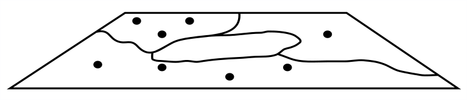
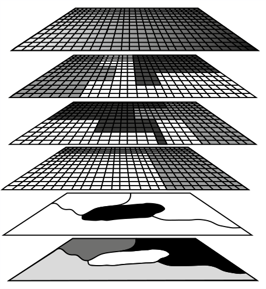
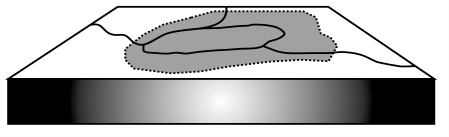
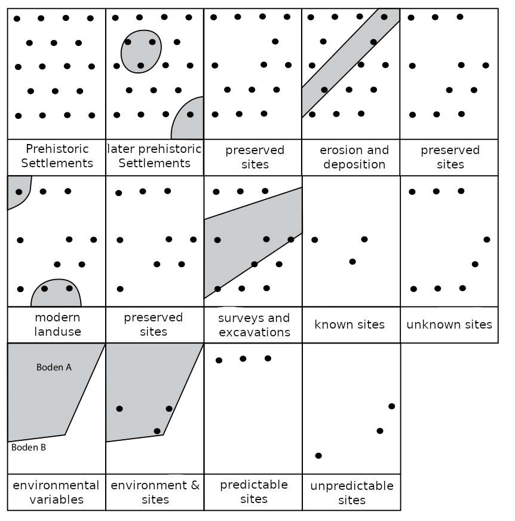
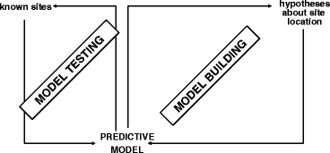
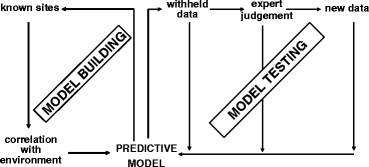
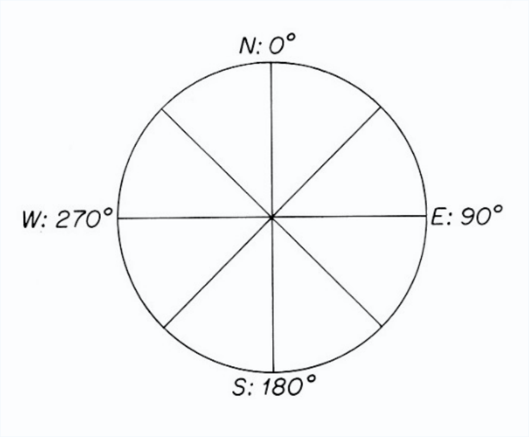

```{r setup, include=FALSE}
options(htmltools.dir.version = FALSE)
```

class: inverse, center, middle

# Background

---

## Predictive Modelling/Mapping

- First considerations for the prediction with the help of environmental data and statistical analysis methods: Human Geography (Haggett 1968)

--

- Until the end of the 1980s, research in this field concentrated in the United States of America

--

- In archaeology for the first time summarizing theory and methodology of modeling Judge and Sebastian (1988)

--

- This development is related to
  - the beginning of natural space analyses with geoinformation systems
  - the development of processual archaeology
  - The integration of heritage management into archaeology

---

## Basic Idea
.pull-left[
- You take a bunch of known sites

- You take a bunch of environmental data

- You add some ~~magick~~ statistics

- You get a prediction for unknown sites
]

.pull-right[
```{r, echo=FALSE, out.width = "150px"}

```

```{r, echo=FALSE, out.width = "150px"}

```

```{r, echo=FALSE, out.width = "150px"}
knitr::include_graphics("images/playmobil_potter.jpg")
```

```{r, echo=FALSE, out.width = "150px"}

```

]
.caption[
(Mostly) Mennenga 2016.
]
---

## Specific archaeological problems

.pull-left[
- sparse data
- noisy data
- no negative evidence
  - we might know, where the sites are, but not, where they not are
- 'biased' preservation
]

.pull-right[
```{r, echo=FALSE, out.width = "400px"}

```
]
.caption[
Mennenga 2016.
]
---

## Two flavours

.pull-left[
### Deductive

```{r, echo=FALSE}

```
.caption[
After Kamermans and Wansleeben (1999).
]

- build on prior assumptions

- data only for testing

- Pro/Con
  - .green[testing straight forward]
  - .red[weakly fitted]
]

.pull-right[
### Inductive

```{r, echo=FALSE, fig.cap="plotting example"}

```
.caption[
After Kamermans and Wansleeben (1999).
]

- build on data (and prior assumptions)

- data used for training & testing

- Pro/Con
  - .green[fitted to the data]
  - .red[testing becomes an issue]
]

---

## Two ends determine strategy

.pull-left[
### Prognosis

- **Were will we find archaeology?**
- biased preservation is implicit
- factors that prevent conservation have a direct negative impact on probability
- negative evidence (non-sites) is less a problem
- resulting model should be more conservative
]

.pull-right[
### Reconstruction

- **Were was prehistoric activity?**
- biased preservation has to be corrected
- conservation-preventing factors indirectly (rather) positively influence probability (unknown unknowns)
- negative evidence becomes important
- resulting model should be more accurate
]


---

## Concentrating on inductive reconstruction

Basically, inductive is ML!

1. You teach the computer what characterises sites
1. Than you let the computer evaluate the whole landscape

### Several approaches

- (expert judgements)
- simple Additive Models
- Kriging
- Cluster Analysis
- Generalised Linear Modelling
- Naive Bayesian
- Support Vector Machines
- Neuronal Networks


---

class: inverse, center, middle

# Getting practical

---

## Data

### Site data

- consisting of location and, if relevant, classification

.center[
```{r, echo=FALSE}
sites_neolithic <- read.csv("data/sites_neolithic.csv")
sites_neolithic$dating <- "neolithic"
knitr::kable(head(sites_neolithic), 'markdown')
```
]
.caption[
Neolithic Sites in Switzerland from RADON.
]
---

## Data

### Site data

- consisting of location and, if relevant, classification

.center[
```{r, echo=FALSE,fig.height=5, out.width='100%'}
library(mapview)
library(sp)
sites_neolithic_sp <- sites_neolithic
coordinates(sites_neolithic_sp) <- ~x+y
proj4string(sites_neolithic_sp)<-CRS("+proj=longlat +datum=WGS84")
mapview(sites_neolithic_sp)

```
]
.caption[
Neolithic Sites in Switzerland from RADON.
]
---

## Data

### Environmental data

Not necessarily only purely 'natural environment', but also eg. second order attributes (eg. Settlement density).

Guidelines:

- Might it have been potentially significant for locational choices of prehistoric people?
- Is it accessible at all?
- Can it be transformed into spatial explicit and extensive data cover?
- Can it be assumed that it (modern data) is indicative for the prehistoric situation?

---

## Data

### Environmental data
.pull-left[
Possible options:

- DEM and derived data
  - altitude, slope, aspect, tpi, ...
- Soil data
- Distance to water
- Viewshed Analysis
- Accessibilty and Least Cost Path networks
- (modern) Land cover
- Ressource Availability
- ...
]

.pull-right[
```{r, echo=FALSE, out.height = "300px"}

```
]
.caption[
Mennenga 2016
]

On spot or in a wider catchment around known sites

Continuous or discrete, metric or ordinal/nominal

---

## Data

### Negative evidence

.pull-left[
Possible options:

- Use real negative evidence
  - eg. linear projects
  - rarely available and trustworthy
- use every location without recorded archaeology
  - .green[total coverage]
  - .red[will result in underestimation]
  - .red[computational expensive]
- use a random selection
  - .red[limited coverage]
  - .red[will result in overestimation]
  - .green[computational less expensive]
]

.pull-right[
```{r, echo=FALSE, out.width = "100%", fig.height = 4, cache=TRUE}
library(raster)
switzerland <- getData('alt', country='CHE', level=0, path = "data/")
random <- sampleRandom(switzerland, 100, xy=TRUE, sp=TRUE)

mapview(random)
```
.caption[
Random locations in Switzerland
]
]

---

## The ~~magick~~\* statistics

We will use two approaches


### Generalised Linear Modelling

$$g(\mu_m) = \eta_m = \beta_{m,0} + X_1 \beta_{m,1} + \cdots + X_p \beta_{m,p} \\ \text{ where } \mu_m = \mathrm{P}(Y = m \mid Y \in \{1,m\} ). \,$$

### Naive Bayesian Classifier

$$p(C_k \mid \mathbf{x}) = \frac{p(C_k) \ p(\mathbf{x} \mid C_k)}{p(\mathbf{x})} \,$$

.footnote[\[\*\] That is enough spells, we will not use equations from now on... ;-)]

---

class: inverse, center, middle

# Getting REALLY practical

---

## Setting the scene

We will use several librarys. We will load the most important ones upfront.

```{r}
library(sp) # library for spatial objects
library(raster) # library for spatial raster data
library(mapview) # nice little library for displaying dynamic maps
library(magrittr) # library for using pipe syntax

```

The warning here:
  - We will have to call some commands with explicitly mentioning the package
---

## Loading site data

A dataset of 64 sites from the RADON Database have been prepared

```{r, cache=TRUE}

sites <- read.csv("data/sites_neolithic.csv")
head(sites)

```

---

## \[Small advertisement block\] .red[Do not run]

The data were extracted using c14bazaar (Clemens Schmid et al. 2018)
.small[

```{r, cache=TRUE, message=FALSE}
library(c14bazAAR)

neolith <- get_RADON() %>%
  determine_country_by_coordinate() %>%
  dplyr::filter(country_coord == "Switzerland",
                sitetype == "settlement")

head(neolith)
```

]

https://github.com/ISAAKiel/c14bazAAR

---

## Making the data spatial

We use sp as spatial library (Swiss Army Knife!)
.small[
```{r, cache=TRUE}
# Define, which columns hold the coordinates
coordinates(sites) <- ~x+y

# Define the projection system
proj4string(sites)<- CRS("+proj=longlat +ellps=WGS84 +datum=WGS84") 

sites
```
]
---

## Displaying spatial data (aka a map)
### Interactive

We use mapview 

```{r, cache=TRUE, out.width = "100%", fig.height = 4}
mapview(sites)
```

---
### static

We can simply plot

```{r, cache=TRUE, out.width = "100%", fig.height = 4}
plot(sites)
```

---
### static, nicer

We can use ggmap
.small[
```{r, out.width = "100%", fig.height = 3, warning=FALSE, message=FALSE, dpi=150}
library(ggmap)

basemap <- get_stamenmap(sp::bbox(sites),
                         zoom=7,
                         maptype = "toner-lite",
                         crop = F)
ggmap(basemap) + geom_point(data=data.frame(sites), aes(x=x,y=y), col="red")
```
]

---

## Loading raster data

A DEM dataset for Switzerland have been prepared
.small[
```{r}

dem <- raster("data/dem_switzerland.grd")
dem

```
]

---

## \[Getting Raster Data\] .red[Do not run]

The raster package holds a convenient function for getting spatial data: `getData()`

.small[
```{r}

dem_raster <- raster::getData(name = "alt", country='CHE', path = "data/")
dem_raster

```
]


- **alt**: aggregated altitude from SRTM

Also available:
- **GADM**: administrative areas
- **SRTM**: refers to the hole-filled CGIAR-SRTM (90 m resolution)
- **countries**: polygons for all countries
- **worldclim**: climate and enviromental variables

---

## Displaying raster data
### Interactive

We use mapview, again

```{r out.width = "100%", fig.height = 4}
mapview(dem)
```

---
### static

We can simply plot

```{r out.width = "100%", fig.height = 4}
plot(dem)
```

---
### static, nicer

We can use ggmap

.small[
```{r warning=FALSE, message=FALSE, dpi=150, out.width="400px", dpi=150, fig.asp=1}
ggmap(basemap) + geom_raster(data=data.frame(raster::rasterToPoints(dem)),
                             aes(x=x,y=y,fill = CHE_msk_alt),
                             alpha=.5) + coord_cartesian()
```
]
---

## Reprojecting spatial data

.tiny[
Currently, we are working in lat-lng space (WGS84). For spatial analysis it is better to use a projected (m based) system. We might use UTM, zone 32 might be optimal for Switzerland.

For vector data:
```{r, cache=TRUE}

sites_utm <- spTransform(sites, crs("+init=epsg:32632"))
sites_utm
```


For raster data (DEM)
```{r, cache=TRUE}

dem_utm <- projectRaster(dem, crs=crs("+init=epsg:32632"))
dem_utm
```
]
---

## Revisualising projected data together
.pull-left[
```{r, cache=TRUE}

plot(dem)

plot(sites,
     pch=19,
     add=TRUE)
```
]
.pull-right[
```{r, cache=TRUE}

plot(dem_utm)

plot(sites_utm,
     pch=19,
     add=TRUE)
```
]

---
## Getting some random sample locations

As negative evidence, we sample some non-sites. We use the DEM as sampling boundary. We can do that regular or random. We will use the latter!
.tiny[
.pull-left[
Regular
```{r, cache=TRUE}

nonsites <- sampleRegular(dem_utm, 1000, sp=T)

plot(dem_utm)
plot(nonsites,
     pch=19,
     add=TRUE)
```
]

.pull-right[
Random
```{r, cache=TRUE}

nonsites <- sampleRandom(dem_utm, 1000, sp=T)

plot(dem_utm)
plot(nonsites,
     pch=19,
     add=TRUE)
```
]
]
---

## Creating DEM derived data
.tiny[
We will use slope, aspect and tpi as predictors. We can calculate them from the dem:
```{r out.width = "100%", fig.height = 4}
env_data <- terrain(dem_utm, opt = c('slope','aspect','tpi'), unit="degrees")
mapview(env_data)
```
]

---
## Special treatment of aspect (circular data)

.pull-left[
Aspect (angle) is a circular variable (359 is very close to 1)
Options:
* use sin/cos
* make it a nominal variable with directions << we do that
]

.pull-right[
```{r, echo=FALSE, out.width="150px"}

```
]
.tiny[
.pull-left[
```{r, cache=TRUE}
summary(env_data$aspect)

```
]

.pull-right[
```{r, cache=TRUE}
env_data$aspect <- ceiling(
  (env_data$aspect + 360/8/2) / (360/8)
  )
env_data$aspect[env_data$aspect>8]<-1

summary(env_data$aspect)

```
]
]

---

## Sampling informations from the environmental data

Now that we have the environmental data, we might extract them at our sample locations (sites and nonsites).
.tiny[
```{r cache=TRUE}
sites <- raster::extract(env_data, sites_utm, sp=T)
nonsites <- raster::extract(env_data, nonsites, sp=T)

summary(sites)
```
]

---
## Save the data for later use

```{r cache=TRUE}
save(sites, nonsites, env_data, file="data/pred_data.RData")
```
