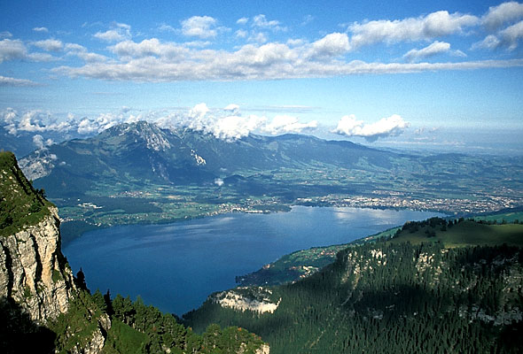
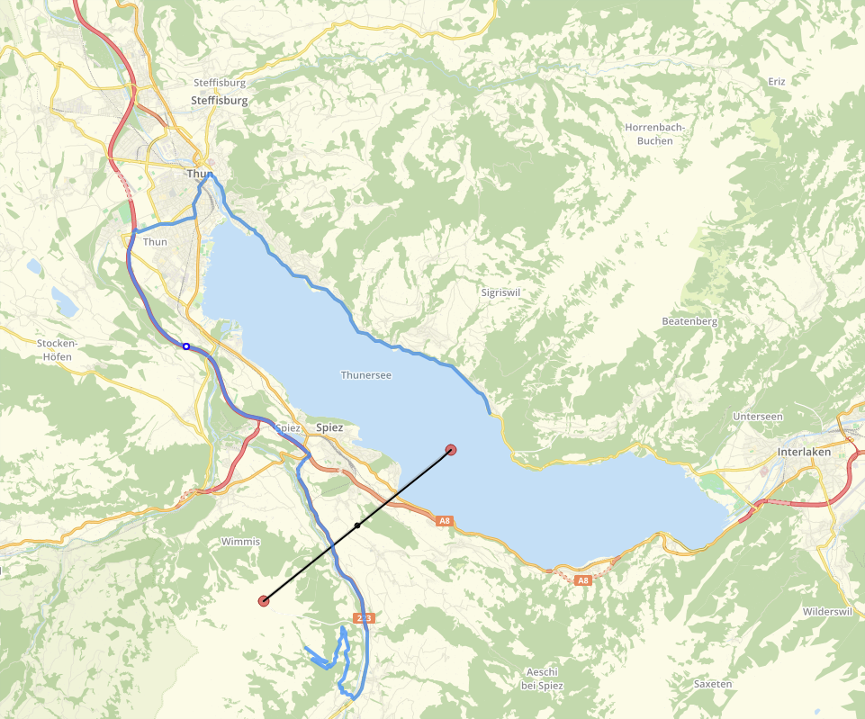
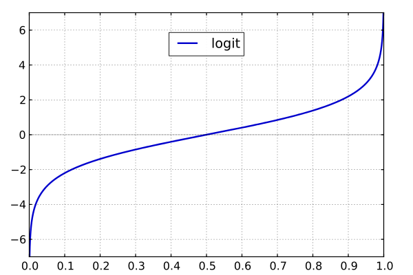
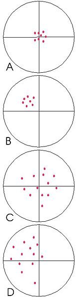

```{r setup, include=FALSE}
options(htmltools.dir.version = FALSE)
library(knitr)
opts_chunk$set(fig.path='presentation_files/presentation2/')
```

class: inverse, center, middle

# GLM

---

## Introducing Linear Model

.pull-left[



]

.pull-right[
* landscape
* two variables:
* altitude
* distance to the lake
* both are connected:
* the higher, the further away from the lake
* altitude of the lake: 558 m asl
* altitude of Niesen: 2362 m asl
* distance lake - mountain: 7000 m
]
---

## Introducing Linear Model
.pull-left[
.tiny[
```{r eval=F}
# random sampling distances

distance <- sample(0:7000, size = 100)

# the altitude depends on the distance
altitude <- 558 + distance/7000*2362

# display the result
# (the slope from the lake
# to the top of the mountain)
plot(distance, altitude)
```
]
]

.pull-right[
.tiny[
```{r echo=F}
distance <- sample(0:7000, size = 100)
altitude <- 558 + distance/7000*2362

plot(distance, altitude)
```
]
]
---

## Introducing Linear Model

Landscapes are usually not even...
.pull-left[
.tiny[
```{r eval = F}
altitude <- 558 + distance/7000*2362 +
  rnorm(n = length(distance),  #<<
        mean = 0,  #<<
        sd = 100) #<<

plot(distance, altitude)
```
]

Introducing an error term to make the data more realistic.

]

.pull-right[
.tiny[
```{r echo=F}
altitude <- 558 + distance/7000*2362 +
  rnorm(n = length(distance), mean = 0, sd = 100)

plot(distance, altitude)
```
]]
---

## Introducing Linear Model

With the data, we might guess the underlying process.

Fitting a linear Model

```{r}

my_model <- lm (altitude ~ distance)
my_model

```

real parameters:
- intercept (altitude of the lake) 558 m asl
- slope distance/7000 \* 2362 = 1/7000 \* 2362 = `r 1/7000*2362`

---

## Introducing Linear Model

Having the model, we can predict altitudes.
.pull-left[
.tiny[

Individual prediction for one value
```{r}

predict(my_model,
        newdata = data.frame(distance = 1000))

```

Prediction for a sequence of values.

```{r}

test_distance <- seq(from = 1000,
                     to = 6000,
                     by = 100)

alt_pred <- predict(my_model,
                    newdata = data.frame(
                      distance = test_distance)
)
```

And plot the result.

```{r eval=F}
plot(altitude ~ distance)

points(test_distance, alt_pred,
       pch = 1, col="red")

abline(my_model, col="blue")
```
]]

.pull-right[
.tiny[
```{r echo=F}
plot(altitude ~ distance)
points(test_distance, alt_pred, pch = 1, col="red")
abline(my_model, col="blue")
```
]]
---

## Introducing Generalized Linear Model

Lets assume, we have settlements. They want to live near the lake (but not in the lake!), less likely at the mountains.
.tiny[

```{r}

# minimum distance
min_dist_settlement <- 100

# maximum distance
max_dist_settlement <- 1000

# sequence between min and max
dist_settlement_seq <- min_dist_settlement:max_dist_settlement

# sample from that, 1000 settlements,
# with decreasing probability
settlement_distances <- sample(dist_settlement_seq,
                               1000,
                               prob = seq( #<<
                                 from=1, #<<
                                 to=0, #<<
                                 length.out = length(dist_settlement_seq) #<<
                               ), #<<
                               replace = TRUE
)

```
]
---

## Introducing Generalized Linear Model

Visualising settlement distribution

.pull-left[
```{r}
plot(
  sort(settlement_distances)
)
```
]
.pull-right[
```{r}
hist(
  settlement_distances
)
```
]
---

## Introducing Generalized Linear Model

Using the histogram to come up with frequency within 100 m classes

.tiny[
.pull-left[
```{r}
freq_hist <- hist(
  settlement_distances,
  breaks = seq(min_dist_settlement,
               max_dist_settlement,
               by = 100)
)
```
]

.pull-right[
```{r}

freq_hist

```
]
]

---

## Introducing Generalized Linear Model

Using the 100 m classes to display frequencies
.tiny[
.pull-left[
```{r}
sett_frequency <- data.frame(
  distance = freq_hist$mids,
  count = freq_hist$counts)

plot(sett_frequency)
```
]]

.pull-right[
```{r echo=F}
freq_hist <- hist(
  settlement_distances,
  breaks = seq(min_dist_settlement,
               max_dist_settlement,
               by = 100)
)
```
]

---

## Introducing Generalized Linear Model
.pull-left[
Modelling settlement frequency
.tiny[
```{r}
sett_model <- lm(count ~ distance,
                 data = sett_frequency)
```
]
Predicting from the settlement model
.tiny[
```{r}
sett_pred <- predict(sett_model,
                     data.frame(distance))
```

]

]

.pull-right[
.tiny[
```{r}
plot(distance, sett_pred)

```
]
]

We do not want negative settlement numbers!

---

## Introducing Generalized Linear Model

It gets even more problematic if we transfer frequency into probability.

.pull-left[
.tiny[
```{r}

sett_prob <- sett_frequency
sett_prob$probability <- sett_frequency$count/
  sum(sett_frequency$count)

```

predicting probability from settlement model

```{r}
sett_prob_model <- lm(probability ~ distance,
                      data = sett_prob)

sett_prob_pred <- predict(sett_prob_model,
                          data.frame(distance))
```
]]

.pull-right[
.tiny[
```{r}

plot(distance, sett_prob_pred, type="l")

```
]]

We do not want negative probabilities!

---

## Introducing Generalized Linear Model

.pull-left[
Responses from a linear Model happens in

$$ \[ -\infty, \infty \] $$

Probability happens in

$$ \[ 0, 1 \] $$

Generalized linear model introduces link functions to 'constrain' responses from models.<sup>\*</sup>

.footnote[.tiny[<sup>\*</sup> That is very simplified, but it will do for now.]]
]

.pull-right[
Introducing a link function



- Transforming probabilities via Logit<sup>\+</sup>
- Fit the model
- transforming predictions back to probabilities
.footnote[.tiny[<sup>\+</sup> I will spare you the formula]]
]

---

## Using GLM for our example

.pull-left[
.tiny[
```{r warning=F}
glm_model <- glm(probability ~ distance,
                 data = sett_prob,
                 family = binomial()) #<<

predict(glm_model)

predict(glm_model, type = "response")

sett_prob_pred_glm <- predict(glm_model,
                        newdata = data.frame(
                          distance
                        ),
                        type="response")

```
]]

.pull-right[
.tiny[
```{r}
out <- data.frame(distance = distance,
                  pred = sett_prob_pred_glm)

out<-out[order(out$distance),]

plot(out, type="l")

```
]]


---

## Resetting the stage
Loading Libraries
```{r}
library(sp)
library(raster)
library(mapview)
```

Reading Data
```{r}
load("data/pred_data.RData")
```

---
## Preparing data for GLM

```{r}

# Combine postive and negative evidence
evidence <- rbind(
  data.frame(sites[,c("tpi", "slope", "aspect")], site=TRUE),
  data.frame(nonsites[,c("tpi", "slope", "aspect")], site=FALSE)
)

# make sure, every place has all values
evidence <- na.omit(evidence)

# result:
head(evidence)
```

---
## Doing the calculation

```{r}

fit <- glm(site ~ tpi + slope + factor(aspect),
           data=evidence,
           family=binomial())

```

Model description (trivial):

If something is a site depends on the tpi, the slope and the aspect (as factor). We use our evidence.

The family is binominal (true or false), resulting in a logit link function.

---
## Resulting Model

.tiny[
```{r}
summary(fit)
```
]

---
## Repredicting our evidence

.pull-left[
.tiny[
```{r}

pcdata <- predict(fit, type="response")

head(pcdata)

```
]
]

.pull-right[
```{r}
boxplot(pcdata ~ evidence$site)
```
]
---
## Checking the prediction

Comparing, how many sites and non-sites were correctly predicted:

```{r}
comp <- data.frame(pred = pcdata>0.5,
                   orig = evidence$site)

table(comp)
```

```{r echo=F}
n <- table(evidence$site)
correct_s <- nrow(subset(comp, pred & orig))
correct_n <- nrow(subset(comp, !pred & !orig))
```
This is called confusion matrix.

`r format(correct_n/n[1] * 100, digits = 4)`% of the nonsites were identified correctly, while `r format(correct_s/n[2] * 100, digits = 4)`% of the sites are predicted.

In total there is a correct prediction rate of `r format((correct_s + correct_n)/sum(n) * 100, digits=4)`%.

.red[Is that a good result? Probably not!]

---
## Why is the prediction so bad?

Remember:
.pull-left[
```{r echo=FALSE, out.height="300px", out.width="100%"}
mapview(env_data$slope) + mapview(sites, color = "red", col.regions = "red") + nonsites
```
]

.pull-right[
```{r, echo=FALSE, fig.height=4}
boxplot(pcdata ~ evidence$site)
```
]

- `r nrow(sites)` sites and `r nrow(nonsites)` nonsites
- much more negative evidence than positive
- in most environmental settings, there are more nonsites than sites
- options
- balancing amount of positive and negative 'evidence'
- working with separation rather than with probability
- good separation here approx. at 0.1

---

## Checking the separation

Comparing, how many sites and non-sites are 'correctly' separated:

```{r}
comp <- data.frame(pred = pcdata>0.1,
                   orig = evidence$site)

table(comp)
```

```{r, echo=F}
test <- table(comp)

n <- colSums(test)
correct <- diag(test)
```
Now it is a true confusion matrix. `r format(correct[1]/n[1] * 100, digits = 4)`% of the nonsites were identified correctly, while `r format(correct[2]/n[2] * 100, digits = 4)`% of the sites are predicted.

In total there is a correct prediction rate of `r format(sum(correct)/sum(n) * 100, digits=4)`%.

.red[Mind, that total prediction rate is a difficult measurement!]
---

## Using the model for the actual predictive mapping

.tiny[
```{r}

# Unfortunately, we have explicitly 'factor' the aspect every time!
env_data.df <- as.data.frame(env_data)
env_data.df$aspect <- factor(env_data.df$aspect)

pdata <- predict(fit,
                 newdata = env_data.df,
                 type = "response")

length(pdata)
summary(pdata)
```
]

.pull-left[
```{r, echo=FALSE, fig.dim=c(4,4)}
boxplot(pdata)
```
]

.pull-right[
- `r length(pdata)` map cells are predicted
- again, most probabilities are low
- the NA result from the margins (where there were no data before)
]

---

## Do the actual mapping

.pull-left[
.tiny[
```{r eval=FALSE}
# Taking the original raster map as base
x_pred <- env_data

# adding the predicted data as new layer
x_pred$pred <- pdata

# Display the map
mapview(x_pred$pred) + sites
```
]

Again, our predicted probabilities are very low!

From an investors perspective, we might be intrigued to use this value (there is only a low chance for archaeology).

As archaeologists, we rather use the separation approach...

]
.pull-right[
```{r echo=FALSE, out.width="100%"}
# Taking the original raster map as base
x_pred <- env_data

# adding the predicted data as new layer
x_pred$pred <- pdata
```
```{r eval=F}
# Display the map
mapview(x_pred$pred) + sites
```

]

---
## Separation, a bit more educated

How much percentage of sites are we willing to loose?

- none? probably resulting in a rather large suspective area
- 5% probably resulting in a smaller suspective area

We try both:

.pull-left[
.tiny[
```{r}
t1 <- min(pcdata[evidence$site])
t2 <- quantile(pcdata[evidence$site],
               prob = 0.05)
```
]
]

.pull-right[
.tiny[
```{r,, echo=FALSE}
boxplot(pcdata ~ !evidence$site,
        names = c("Sites", "Nonsites"))

abline(h=c(t1, t2), col="red")
text(y=c(t1, t2),x=1.5,
     labels = c("t1", "t2"))
```
]]

---

## Separation applied and mapped
```{r,, echo=FALSE}
# Cutting into classes using cut
pdata_class <- cut(pdata,
                   breaks = c(-Inf,
                              t1,
                              t2,
                              Inf),
                   labels=c("below_treshold",
                            "all_sites",
                            "95%_sites"),
                   include.lowest = TRUE,
                   right = FALSE,
                   ordered_result = TRUE
)

classes <- levels(pdata_class)

# adding the predicted data as new layer
x_pred$pred_class <- pdata_class
```

.pull-left[
.tiny[
```{r, eval=FALSE}
# Cutting into classes using cut
pdata_class <- cut(pdata,
                   breaks = c(-Inf,
                              t1,
                              t2,
                              Inf),
                   labels=c("below_treshold",
                            "all_sites",
                            "95%_sites"),
                   include.lowest = TRUE,
                   right = FALSE,
                   ordered_result = TRUE
)

classes <- levels(pdata_class)

# adding the predicted data as new layer
x_pred$pred_class <- pdata_class

# Display the map
mapview(x_pred$pred_class) + sites

```
]]
.pull-right[
.tiny[
```{r, fig.dim=c(5,5), echo=FALSE}
# Display the map
mapview(x_pred$pred_class) + sites
```
]
]

.footnote[.tiny[<sup> \* </sup> This is not the final model: We will soon see a better version!]]

---

## Interlude: Function for prediction of Probability Classes

```{r, fig.dim=c(5,5)}
source("scripts/predict_prob_classes.R")

test <- predict_prob_classes(my_model = fit, my_env_data = env_data.df, my_evidence = evidence, probs = c(0,0.05))

summary(test)
summary(pdata_class)

```

---

## Which level to choose?
### Introducing Gain

Always a compromise between predicting as precise as possible and as accurate as possible.

.pull-left[
.right[


.caption[Source: Wikipedia]
]
]

.pull-right[
A- Precise and accurate 

B- Precise but not accurate

C- Accurate but imprecise

D- Not accurate nor precise
]

---

## Which level to choose?
### Introducing Gain

Gain is a standard measure how good a predictive model performs<sup>\*</sup>:

$$Gain = 1 - \frac{p_a}{p_s}$$

p<sub>a</sub> = Percentage of the area under suspicion as a percentage of the total area
p<sub>s</sub> = Percentage of sites in the suspected area to the total number of sites

It means:
- The smaller the predicted area, the higher the gain > precision
- The more sites in correctly predicted, the higher the gain > accuracy

.footnote[.tiny[<sup>\*</sup> So, I lied. Here is another formular. But it is not so difficult, is it?]]
---

## Which level to choose?
### Gain our model
.pull-left[
.tiny[
```{r}
# How many sites per class
site_classes <- 
  table(
    factor(raster::extract(x_pred$pred_class,sites),
           levels = c(1,2,3))
  )

site_classes_n <- rev(cumsum(rev(site_classes)))

# Number of sites within class (inclusive)
site_classes_n

raster_classes <- table(
  values(x_pred$pred_class)
)

raster_classes_n <- rev(
  cumsum(rev(raster_classes))
)

```
]]

.pull-right[
.tiny[
```{r}

# calculating pa

pa <- raster_classes_n/sum(raster_classes)
pa

```

`r round(pa[2]*100, 2)`% of the area belongs to the class 'all_sites', `r round(pa[3]*100, 2)`% to class '95%_sites'.

```{r}

# calculating ps

ps <- site_classes_n/sum(site_classes)
ps

```

Same structure like above. Note that it is not 100% and 95%, because we have only `r sum(site_classes)` sites, and the quantiles are estimated!
]]

---

## Which level to choose?
### Gain for our model

.pull-left[
.tiny[
```{r}

# gain

g <- 1 - pa/ps
g

```
]
]

.pull-right[

- The null model (all area) has a gain of 0. Since it is all area, the prediction is rather trivial...
- The all sites model has a gain of `r round(g[2],2)`. This is rather bad!
- The 95% sites model has a gain of `r round(g[3],2)`. This is also not so good. But what an improvement!

Remember: Gain ranges from 0 (all area, or no site predicted) to (theoretically) 1 (point prediction of the sites).
]

\> Can we get any better?
---
## Interlude: Function for Gain

```{r}

source("scripts/model_gain.R")

model_gain(x_pred$pred_class, sites)
g

```

---
## Improving the prediction using polynoms

Back to our original example

.pull-left[


]
.pull-right[
It is unlikely, that a mountain slope is so linear!

```{r echo=F}
# distance <- sample(0:7000, size = 100)
# altitude <- 558 + distance/7000*2362

plot(distance, altitude)
```
]

---
## Improving the prediction using polynoms

.pull-left[
Probably, it is more curved.
.tiny[
```{r, eval=F}

altitude <- 558 + (distance)^4/(7000)^4*2362 +
  rnorm(n = length(distance),
        mean = 0,
        sd = 100)

plot(distance, altitude)
abline(lm(altitude~distance))
```
]]

.pull-right[
A strictly linear model will not work here!

```{r echo=F}
altitude <- 558 + (distance)^4/(7000)^4*2362 +
  rnorm(n = length(distance),
        mean = 0,
        sd = 100)

plot(distance, altitude)
abline(lm(altitude~distance))
```
]

---

## Improving the prediction using polynoms

We also have to incorporate the polynom into the model!
But which (not knowing, that we used 4th grade...)?
.tiny[
```{r fig.height = 4}
plot(distance, altitude)

model2 <- lm(altitude~I(distance^2))
model3 <- lm(altitude~I(distance^3))
model4 <- lm(altitude~I(distance^4))

lines(test_distance, predict(model2, newdata = data.frame(distance = test_distance)), col = "red")
lines(test_distance, predict(model3, newdata = data.frame(distance = test_distance)), col = "green")
lines(test_distance, predict(model4, newdata = data.frame(distance = test_distance)), col = "blue")

```
]

---

## Improving the prediction using polynoms

We use function mfp to identify it for us:
.tiny[
```{r fig.height = 4}
library(mfp)

plot(distance, altitude)

model_mfp <- mfp(altitude~fp(distance))
model_mfp$formula

lines(test_distance, predict(model_mfp, newdata = data.frame(distance = test_distance)), col = "red")

```
]

---

## Using mpf

```{r, message=F, warning=F}
mfp_fit <- mfp(site ~ fp(tpi) + fp(slope) + as.factor(aspect),
               data = evidence, family=binomial)

```

Model description (trivial):

If something is a site depends on the tpi, the slope and the aspect (as factor). Alter the polynom of the predictors. We use our evidence.

The family is binominal (true or false), resulting in a logit link function.

---
## Model Summary

.tiny[
```{r, echo=F}

summary(mfp_fit)

```
]
---

## Repredicting our evidence

.pull-left[
.tiny[
### Boxplot of polynomial Model
```{r}

pcdata.mfp <- predict(mfp_fit, type="response")
boxplot(pcdata.mfp ~ evidence$site)

```
]
]

.pull-right[
### Boxplot of straight GLM
```{r}
boxplot(pcdata ~ evidence$site)
```
]

---
## Prediction > Separation > Mapping
.tiny[
```{r, message=F, warning=F}
source("scripts/predict_prob_classes.R")

pdata_class.mfp <- predict_prob_classes(my_model = mfp_fit,
                                        my_env_data = env_data.df,
                                        my_evidence = evidence,
                                        probs = c(0,0.05))

x_pred$pred_class.mfp <- pdata_class.mfp

```
]

---

## Comparing the Maps

.tiny[
```{r, message=F, warning=F, out.width="100%", fig.height=6}
mapview(x_pred$pred_class.mfp) +
  mapview(x_pred$pred_class) +
  mapview(sites)
```
]

---
## Caculating Gain

.tiny[
```{r}

this_gain <- model_gain(x_pred$pred_class.mfp, sites)

```

.pull-left[
### Gain Values MFP
```{r}
this_gain
```
]
.pull-right[
### Gain Values Straight Model
```{r}
g

pa

ps
```
]
]

---
## Save the data for later use

```{r}
save(sites,
     nonsites,
     env_data,
     evidence,
     env_data.df,
     x_pred,
     file="data/pred_data2.RData")
```
